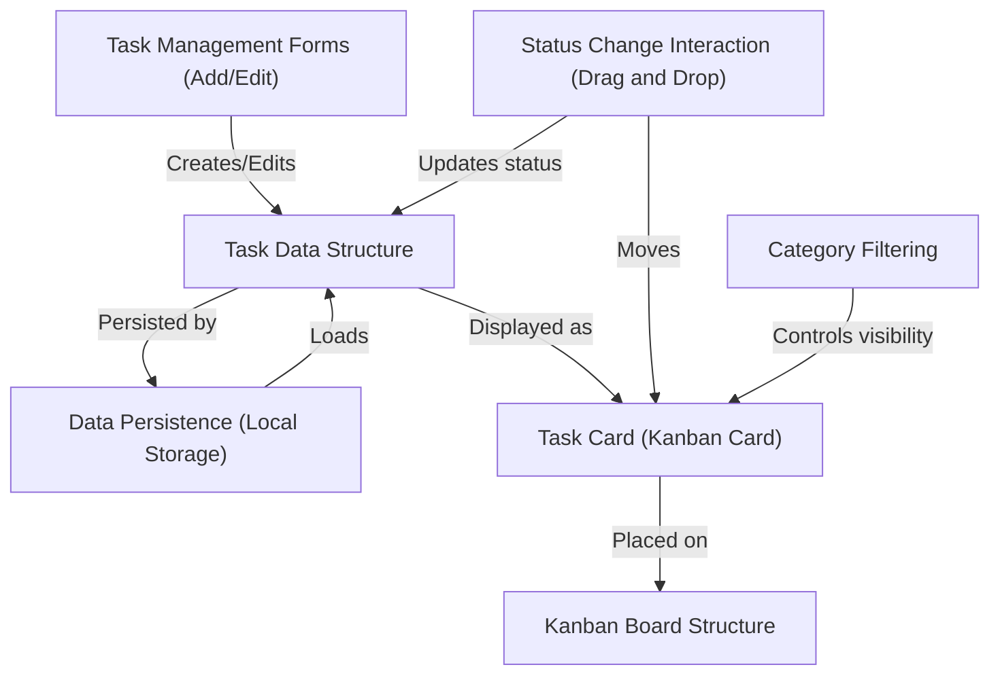

# DASHBOARD-TO-DO

This project is a simple task management dashboard that uses a *Kanban board* layout.
It allows users to **add, edit, and delete** tasks, organize them into *categories*,
and visually track their progress by **dragging cards** between "To Do", "In Progress",
and "Completed" columns. All your tasks are automatically **saved in your browser**,
so they are still there when you revisit the page.

## Visual Overview

## Features

- **Kanban Board Interface**: Visually organize tasks in "To Do", "In Progress", and "Completed" columns.
- **Task Creation and Editing**: Add new tasks or edit existing ones through intuitive pop-up forms (modals).
- **Drag & Drop Status Updates**: Move tasks between columns by dragging and dropping them to update their status.
- **Task Tagging & Filtering**: Assign tags (e.g., "Work", "Personal") to tasks and filter the board to view only tasks of a specific category.
- **Data Persistence**: All tasks are saved in the browser's Local Storage, so your data is preserved across sessions.
- **Responsive Design**: A clean and functional layout that works across different screen sizes.

## Technical Overview

This project is built without any external frameworks, relying on core web technologies to demonstrate fundamental concepts of front-end development.
